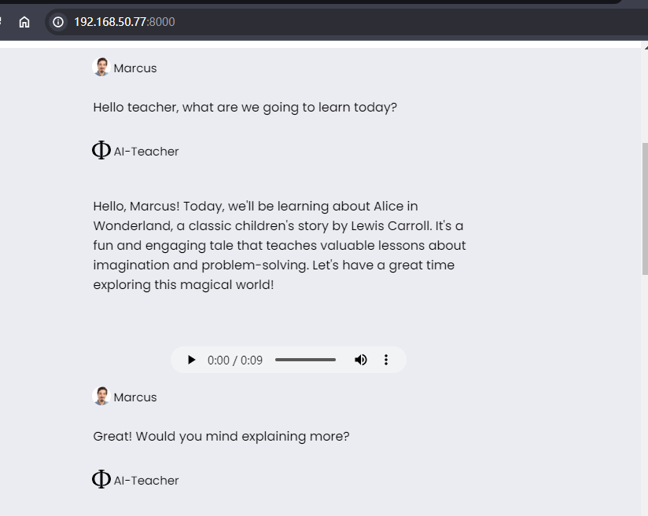

# Oral English Practice Platform

This project is a fork of Collabora/WhisperFusion, with modifications made to tailor it for building an oral English practice platform. The motivation behind this fork was the need for a cost-effective alternative to expensive tools, especially considering limitations such as insufficient GPU memory and outdated hardware.

## I have a GPU 1080 8G, so:

- **Not enough GPU memory for large models**
- **Outdated GPU for WhisperSpeech**: The hardware may not meet the requirements for WhisperSpeech, causing compatibility issues.
- **TensorRT instability**: TensorRT, while promising, may crash intermittently, leading to unreliable performance.

## Solutions Implemented:

- **Removal of TensorRT**: TensorRT was removed from the project to simplify the setup and avoid instability issues.
- **Exploration of CPU usage**: While using the CPU is an option, it may result in inadequate performance for real-time oral chat situations.
- **Evaluation of alternative models**: Phi-2 and MiniCPM with float16 were tested for performance. Ultimately, MiniCPM was chosen for its suitability.
- **Memory management with LangChain**: LangChain was initially explored but proved challenging to control GPU memory usage. A simpler approach with one history version was implemented instead.
- **Text-to-speech (TTS) alternatives**: Experimentation with alternative TTS solutions was conducted, including the possibility of replacing PCM with encoded WAV.

## Usage:

To use this platform, follow these steps:

1. Install the required dependencies by running:
pip install -r requirements.txt (oops! I forgot to update this ..)

2. Start the server by running:
python server.py

## Demo:

Below are some screenshots or videos demonstrating the functionality of the platform. 

## License:

This project is licensed under the [MIT License](LICENSE).

## Acknowledgments:

This project was made possible thanks to the original work by Collabora on WhisperFusion. We extend our gratitude to the open-source community for their contributions.
